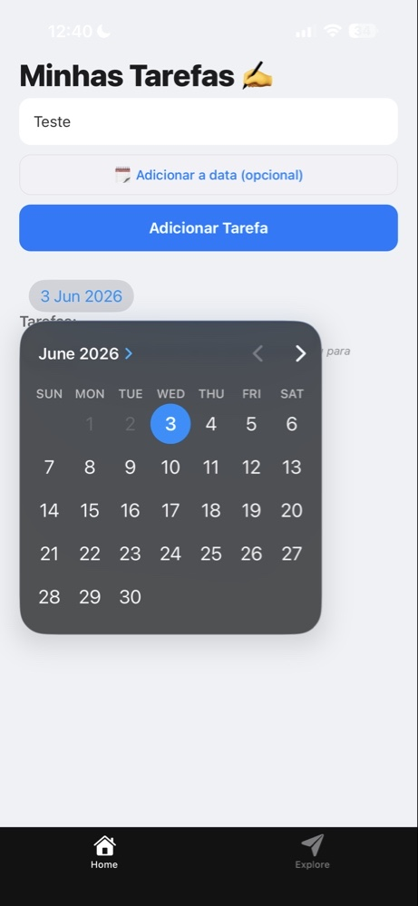
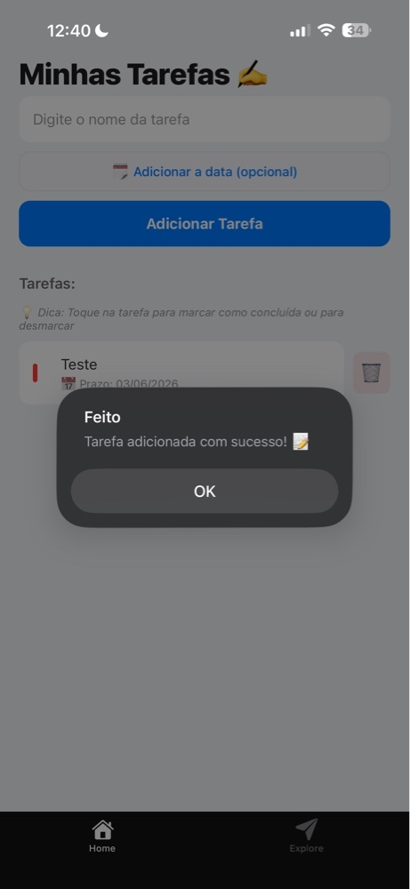
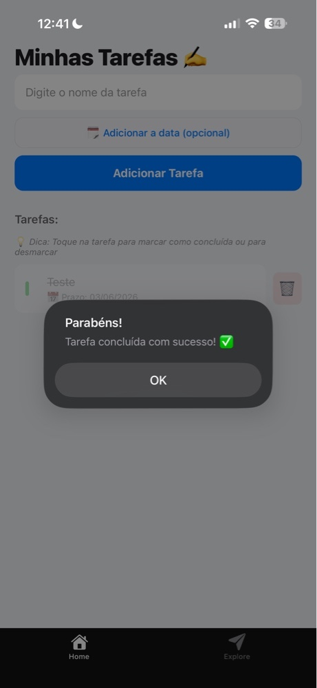

# SwiftDo 🚀

Aplicativo mobile desenvolvido com React Native para gerenciamento inteligente de tarefas em tempo real, integrando um banco de dados reativo na nuvem.

## 🎯 Objetivo

Este projeto foi desenvolvido com o objetivo de consolidar conceitos de desenvolvimento mobile utilizando **React Native** e **TypeScript**, focando em arquiteturas modernas orientadas a eventos e backend-as-a-service (BaaS). Os principais pontos praticados foram:

- Gerenciamento de estados locais e sincronização assíncrona.
- Arquitetura CRUD completa operando em tempo real.
- UX/UI Mobile (feedbacks nativos com `Alert` e manipulação de seletores de datas).
- Integração e tipagem estrita entre Frontend e rotas do Backend.

## 📱 Preview

| 01. Fluxo Inicial | 02. Definição de Prazos |
| :---: | :---: |
|  |  |

| 03. Confirmação de Cadastro | 04. Fluxo de Conclusão |
| :---: | :---: |
|  | 

## 🛠 Tecnologias

- **React Native** (com **Expo Router**)
- **TypeScript** (Tipagem estrita de ponta a ponta)
- **Convex** (Banco de dados reativo e Cloud Functions)
- **React-Native-Community/DateTimePicker** (Manipulação nativa de datas)

## ✨ Funcionalidades

- **Gerenciamento de Tarefas:** Criar, listar, alternar status de conclusão e excluir tarefas de forma instantânea.
- **Definição de Prazos:** Interface com seletor de calendário nativo integrado ao fluxo de cadastro.
- **Validação Inteligente:** Tratamento de campos vazios e tratamento lógico para exibição de prazos zerados.
- **Mensagens de Confirmação:** Feedback visual dinâmico através de `Alerts` para inserções, exclusões e conclusões.
- **Sincronização Real-time:** Alterações refletidas no dispositivo sem necessidade de recarregar a lista (Pull-to-refresh manual descartado).

## 🚀 Como Executar o Projeto

### Pré-requisitos
Possuir o Node.js instalado e o aplicativo **Expo Go** instalado no celular (ou um emulador configurado).

1. **Clone o repositório:**
```bash
git clone https://github.com/GabrielRGalvao/swiftdo-app.git
cd swiftdo-app